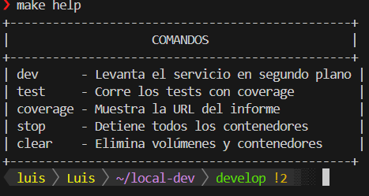
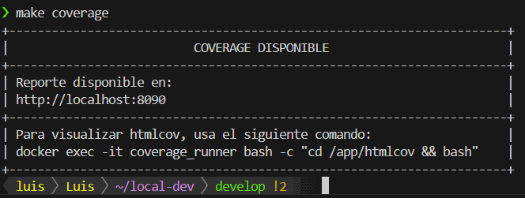
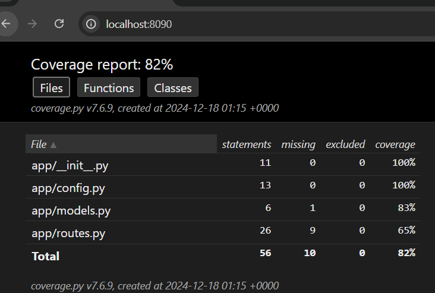

## Intro

El repositorio local-dev contiene la configuración necesaria para desarrollar y probar nuestra aplicación de forma local. Aquí se incluyen los servicios mínimos (código Python, base de datos SQLite, scripts y un Dockerfile) para facilitar el flujo de trabajo en la máquina de cada desarrollador.

---

### Arquitectura de Software

En este proyecto, la arquitectura local se apoya principalmente en Docker. La aplicación Flask se monta localmente y se conecta a una base de datos SQLite.

- **Flask app**


Monta el código fuente dentro de un contenedor Docker, permitiendo iterar y probar sin tener que hacer builds de la imagen en cada cambio.
Maneja la lógica principal de la aplicación web.

- **SQLite DB**


Para este entorno de desarrollo y pruebas, se ha optado por SQLite, lo cual simplifica la configuración (no requiere un contenedor adicional para la DB).
Permite pruebas unitarias sin overhead de instalación.

- **Tests automáticos**


Dentro de la carpeta tests/, se definen pruebas que pueden ejecutarse localmente con pytest.
Al finalizar, se genera un reporte de coverage para revisar la calidad de nuestro código.

- **Tecnologías usadas:**


- Flask como framework web en Python.
- SQLite para persistencia mínima local.
- Docker y un Dockerfile base (opcionalmente Docker Compose).
- Flake8 para linting.
- pytest + coverage para test.

---

3. **Inicializar el entorno de desarrollo**

    - Primero Clona el repositorio

```bash
git clone https://github.com/LuisHenaoS/local-dev.git
cd local-dev
```

- Se dispone de un makefile que te proporciona ayuda. Usa:


```bash
make help
```

Te saldrá:





---


- Luego Levanta la aplicación


bastar con usar:

```bash
make dev
```
    Al cabo de unos segundos, la aplicación Flask quedará expuesta en el puerto 5000 (definida en la configuración).
Nota: El uso de SQLite simplifica el arranque. No hay necesidad de un contenedor independiente para la base de datos.

**Ejecución de los Tests**


Usa el Makefile:

```bash
make tests
```


```bash
make coverage
```



---


Abre el archivo htmlcov/index.html en el navegador para ver los porcentajes de cobertura.



---

Para detener la aplicación y limpiar volúmenes o archivos temporales, se puede usar:

```bash
make clear
```

Esto eliminará contenedores, redes y cualquier residuo del entorno local.


6. **Modelo de colaboración (Gitflow)**

main: Rama principal, siempre en estado estable.

Develop: Rama donde se integran las nuevas características.